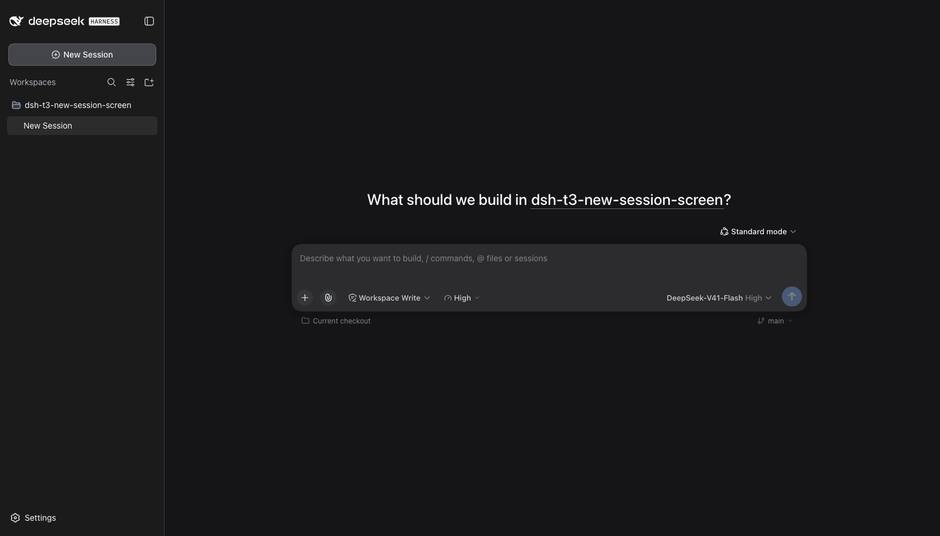
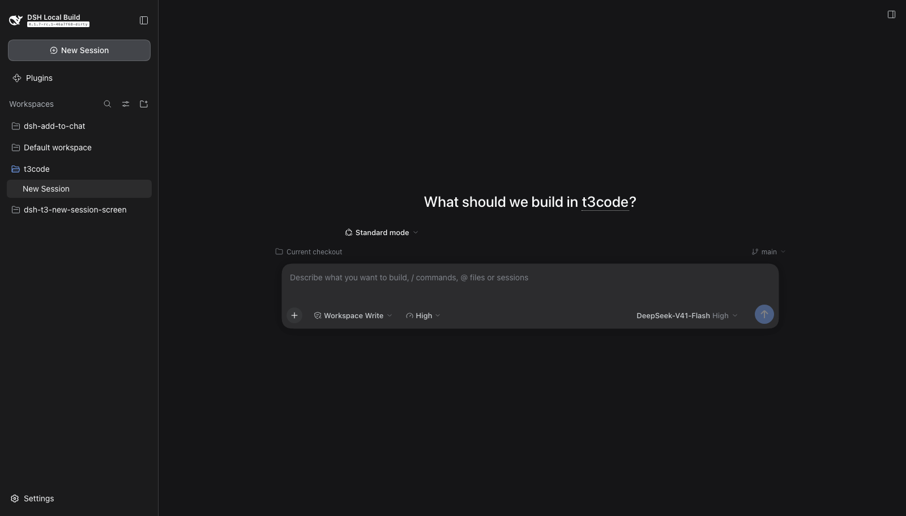
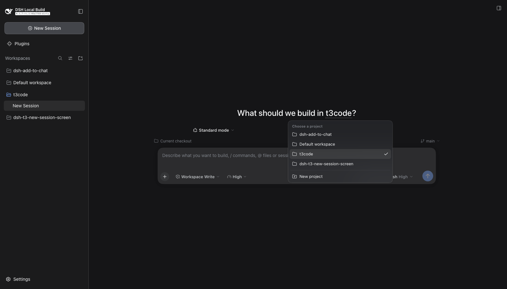
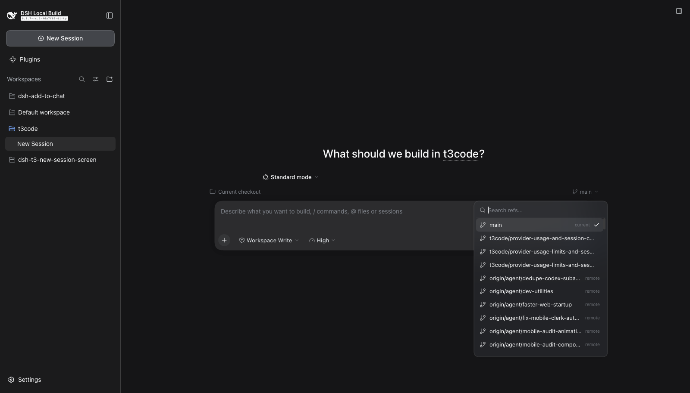
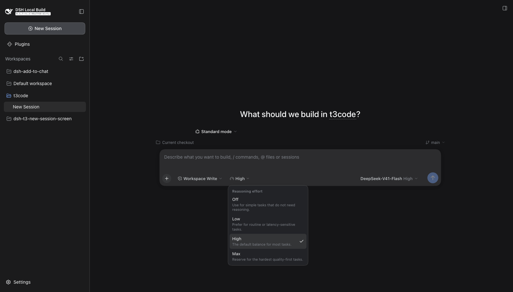

# dsh-t3-new-session-screen

T3 Code's **New Session screen** for the
[DeepSeek Harness](https://github.com/deepseek-ai/deepseek-harness) composer.



Three things that screen has and DeepSeek Harness's blank session does not:

- **`What should we build in <project>?`** — the headline from T3's
  `DraftHeroHeadline`, where the project name is itself the picker.
- **A reasoning-effort picker** — T3's `TraitsPicker`, surfaced in the composer
  tool row instead of hidden behind the model menu.
- **A git branch picker** — T3's `BranchToolbar`, with real `git checkout`.

## Credit

The screen this plugin implements is T3 Code's. The headline sentence and its
inline project control, the effort picker's shape, and the branch strip with its
searchable ref menu are all theirs. T3 Code is
[open source under MIT](https://github.com/pingdotgg/t3code/blob/main/LICENSE);
this port keeps the same behaviour and swaps the data underneath for DeepSeek
Harness's own services. Please support the original project.

## Features

- **The headline.** `What should we build in <project>?`, centred over the
  composer, with the project name underlined and clickable. Clicking it opens a
  T3-shaped project menu: every registered workspace, a check on the current
  one, a divider, and **New project**. Picking a project moves the blank session
  to it. DSH renders its own headline from a literal string with no slot, so
  this plugin fills the only additive hole in that row
  (`conversation.hero.brand.mark`) and suppresses the shipped title beside it.
  The template is configurable, and `{project}` marks where the control goes.
- **Reasoning effort.** A gauge control in the composer tool row showing the
  level the current model is actually using (`Off`, `Low`, `High`, `Max` for
  DeepSeek's own models). The menu carries each level's description and a check
  on the current one. It reads and writes the same per-session model directory
  the model seat uses, so the model seat's own label updates with it. A model
  that advertises no effort levels renders no control at all — effort is a
  per-model capability, not a global preference.
- **Git branch.** A strip under the composer card: the checkout on the left, the
  current ref on the right. The ref menu searches, lists local and remote refs,
  labels `current` / `default` / `remote`, and switches with
  `git checkout <ref>`. A **Create new ref** row appears once the query names a
  ref that does not exist yet, and runs `git checkout -b`. DSH ships no git
  surface of any kind, so every fact here comes from this bundle's Host half.

## Screenshots

| The New Session screen | Project menu | Branch picker | Reasoning effort |
|---|---|---|---|
|  |  |  |  |

## Install

From this repository:

```sh
dsh plugin --profile web add github:yusufameri/dsh-t3-new-session-screen
```

Once the package is on npm, the registry form is one word shorter:

```sh
dsh plugin --profile web add dsh-t3-new-session-screen
```

Either reconciles the profile's bundle list, so the next boot merges the
plugin's patch and loads its client half. Removing the bundle restores the
shipped headline, model seat and composer with no residue.

## Configuration

Every field is optional; the defaults render the whole screen. Set them on the
bundle's row in the profile's `cordis.patch.yml`:

```yaml
- id: t3-new-session-screen
  name: 'dsh-t3-new-session-screen'
  config:
    headlineText: 'What should we build in {project}?'
    effortSlot: right
    branchCreateEnabled: false
```

| Key | Default | Meaning |
|---|---|---|
| `headlineEnabled` | `true` | Replace the blank-session headline with the T3 sentence. |
| `headlineText` | `What should we build in {project}?` | Headline template; `{project}` becomes the interactive project name. Without the hole the sentence renders as plain text. |
| `hideShippedHeadline` | `true` | Hide DSH's own "Into the Unknown" title beside the headline. |
| `hideWorkspaceChip` | `true` | Hide the shipped workspace chip under the headline, which the headline supersedes. |
| `effortEnabled` | `true` | Reasoning-effort picker in the composer tool row. |
| `effortSlot` | `left` | Which composer seat the effort picker occupies: `left` (beside the permission and plan controls) or `right` (beside the model seat). |
| `branchEnabled` | `true` | Git branch strip on the new-session screen. |
| `branchCreateEnabled` | `true` | Offer **Create new ref** (`git checkout -b`) in the branch picker. |
| `gitEnabled` | `true` | The git bridge behind the branch strip. Turning it off leaves the strip absent. |
| `gitTimeoutMs` | `30000` | Budget of one `git` child process. |

The client half reads the resolved configuration from the Host over the same
route the branch data uses, so a change takes effect on the next page load.

## How it works

The whole screen is contributed through DSH's own seams.

| Piece | Seam |
|---|---|
| Headline | `conversation.hero.brand.mark` (single, root) — the only additive hole in DSH's headline row. |
| Project menu | `conversation.hero.workspace` (single, root) at priority `-1`, which shadows the shipped `WorkspacePicker` in the same cell. |
| Project roster | The root `useWorkspaces` standard hook, fed by `ctx.slots.provideRoot`. |
| New project | `ctx.uiWorkspace.pickDirectory()` then `ctx.workspaces.create({ path })`. |
| Reasoning effort | `conversation.input.left` / `.right` (list), reading `ctx.modelDirectories.directoryFor(sessionId)`. |
| Branch strip | `conversation.input.dock` on the blank-session hero and `conversation.composer.dock` once a session has a first turn. |
| Working directory | `ctx.sessions.list.getSnapshot().byId[sessionId]?.cwd`. |
| Git | The Host half's fenced `POST /t3-new-session/api` route (`config`, `git.status`, `git.branches`, `git.checkout`, `git.createBranch`), running `git` through `node:child_process`. |

Two details are load-bearing rather than incidental:

- The client half must inject `remote` and `remote.session`.
  `modelDirectories.directoryFor` resolves through Cordis's caller-context
  tracker, so a plugin that reads the model directory without holding the same
  remote namespace gets `cannot get property "remote.session" without inject`
  and the effort control silently disappears.
- The Host half imports nothing outside `node:*`. A plugin installed as a
  directory link resolves its imports from its own real path, where none of
  DSH's `@deepseek-ai/*` packages are reachable, so the configuration schema is
  a hand-written [Standard Schema](https://standardschema.dev) rather than a
  Schemastery one — Cordis needs nothing more than a synchronous
  `~standard.validate`.

## Differences from T3

DSH has no equivalent of these T3 concepts, so the port leaves them out rather
than faking them:

- **No local/worktree environment switch.** T3's strip opens with a
  `Current checkout` / `New worktree` selector. DSH has no worktree concept, so
  the strip's left label reports the checkout and is not a menu.
- **No pull-request badge** on the strip.
- **The strip sits above the composer card on the new-session screen.** DSH
  renders no extension seat below the card until a session has a first turn, so
  the hero uses the full-width seat above it. Once a session is underway the
  strip moves below the card, matching T3.

One behaviour worth knowing: DSH's `session/selectModel` writes the session
selection **and** the deployment default, so picking an effort level also makes
it the default for new sessions. That is the Host's behaviour, not this
plugin's; it is the same thing the shipped model menu does.

## Development

```sh
# one-time: shim pnpm if it is not on PATH
mkdir -p ~/.dsh/dsh-runtimes/shim

# install into a scratch profile and boot it
dsh plugin --profile t3demo add "$PWD"
dsh --profile t3demo --port 8899 --no-open
```

The capture tooling behind `assets/` is in `scripts/`: `record.mjs` drives a
scripted interaction over one Chrome DevTools Protocol connection (and can
record frames), `encode-gif.py` turns those frames into the GIF, and
`capture-stills.json` / `demo-steps.json` are the two scripts it runs.

```sh
CDP_PORT=9333 node scripts/record.mjs scripts/capture-stills.json --no-frames
CDP_PORT=9333 node scripts/record.mjs scripts/demo-steps.json /tmp/frames
python3 scripts/encode-gif.py /tmp/frames assets/demo.gif
```

## License

MIT. T3 Code is MIT too; see [Credit](#credit).
